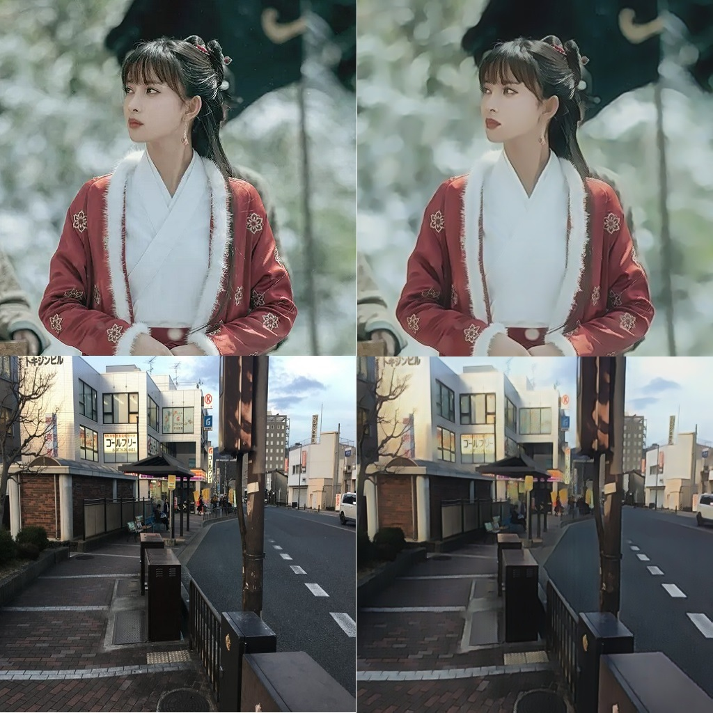

# AnimeGANv3 for Pytorch

( [English](./README.md)  |  [中文](./Chinese.md) )

This is the PyTorch version of AnimeGANv3 model based on the original DTGAN model.

## Introduction

As AnimeGANv3 adopts the new DTGAN model and there is currently no corresponding open-source PyTorch solution, this project migrates some contents based on the original author's open-source TensorFlow version code.

## Updates

1. Migrated the DTGAN main model framework to PyTorch version.

2. Migrated the VGG19 model for training to PyTorch, and exported the VGG19 model parameters from the original authors to a .pth file for PyTorch to call.

3. moved the image preprocessing operations to prepearing.py.

4. Migrated the loss function for training to PyTorch, and completed the related testing.

## Instructions for Using

### Project Structure

- /dataset is used to store the image files required for training.

- /model_state is used to store the results of model parameters after different epochs during training.

- /tools is used to store the loss function and image enhancement methods for training.

```tree
├───dataset
│   ├───ChinaPhoto
│   │   ├───smooth
│   │   ├───smooth_noise
│   │   └───style
│   ├───seg_train_5-0.8-50
│   ├───shinkai
│   │   ├───smooth
│   │   ├───smooth_noise
│   │   └───style
│   ├───test
│   │   ├───HR_photo
│   │   ├───label_map
│   │   ├───real
│   │   ├───test_photo
│   │   └───test_photo256
│   ├───train_photo
│   └───val
├───model_state
│   └───ChinaPhoto
├───tools
| DTGAN.py
| AnimeGAN.py
| preparing.py
| export_to_onnx.py
| 
| ·······
| ·······
```

### Initialising the Environment

- Installing Python3
- Cloning the project locally
- Install the dependencies needed to run

```shell
python -m pip install -r requirements.txt
```

### Preparation of Training Data

Scale the training images to 256x256 or 512x512, put them into the /style folder in /dataset, and run the following command line to preprocess the training data

```shell
python preparing.py --dataset ChinaPhoto --img_size 256
```

### Model training

Model training can be started using the following command line

```shell
python train.py --dataset ChinaPhoto --init_G_epoch 10 --epoch 50 --start_epoch 1 --batch_size 8 --device cpu
```

Recommend using P100 or higher GPU for training, but you can also try using DirectML on a non-NVIDIA device.

### Model Deployment

- The project supports export and deployment in ONNX format.
- The exported model needs to pass in data by [batch, channel, height, width] and the colour channel is of BGR type.
- The data format of the processed image is the same as that of the incoming image.

```python
import onnxruntime as ort

model = ort.InferenceSession("./generate.onnx", providers=["CPUExecutionProvider"])
out_img = model.run(None, {"input": image_input})
show_image(out_img[0])
```

## Showing the Results



## License

Please refer to the relevant permission statement of the original author.

```md
This repo is made freely available to academic and non-academic entities for non-commercial purposes such as academic research, teaching, scientific publications.  
Permission is granted to use the AnimeGANv3 given that you agree to my license terms.  
Regarding the request for commercial use, please contact us via email to help you obtain the authorization letter.
```

## Author

Liu `liuzhi1999@foxmail.com`
